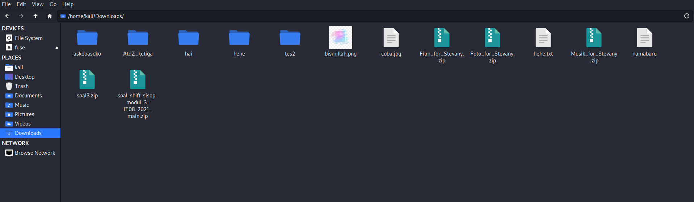
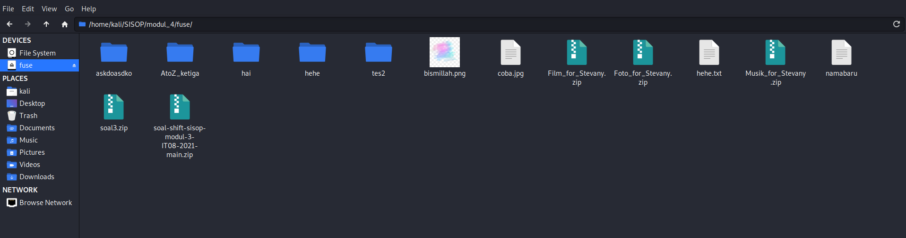
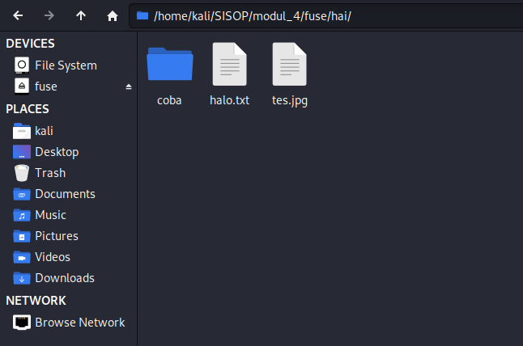
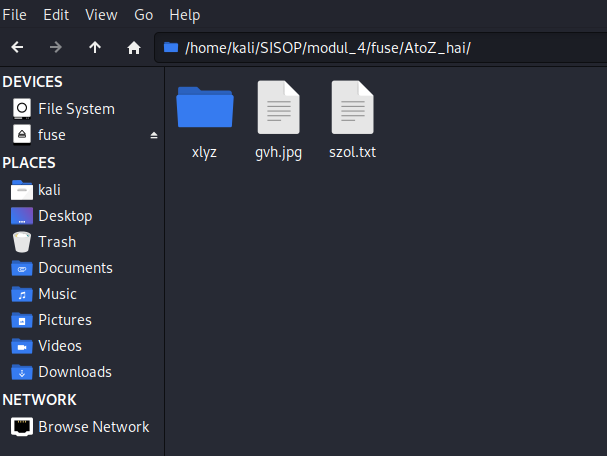
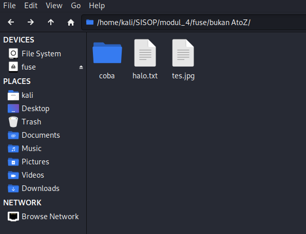
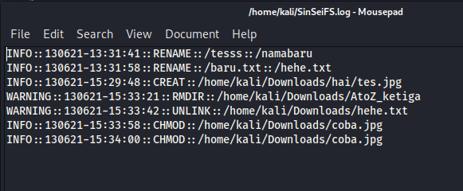

# soal-shift-sisop-modul-4-IT08-2021

#

1. Tri Rizki Yuliawan (05311940000024)
2. Tera Nurwahyu Pratama (05311940000039)
3. Justin Alfonsius Sitanggang (05311840000043)

#

- [Soal 1](#soal1)
- [Soal 4](#soal4)

# Soal1

Di suatu jurusan, terdapat admin lab baru yang super duper gabut, ia bernama Sin. Sin baru menjadi admin di lab tersebut selama 1 bulan. Selama sebulan tersebut ia bertemu orang-orang hebat di lab tersebut, salah satunya yaitu Sei. Sei dan Sin akhirnya berteman baik. Karena belakangan ini sedang ramai tentang kasus keamanan data, mereka berniat membuat filesystem dengan metode encode yang mutakhir. Berikut adalah filesystem rancangan Sin dan Sei :

## Note:

Semua file yang berada pada direktori harus ter-encode menggunakan Atbash cipher(mirror).
Misalkan terdapat file bernama kucinglucu123.jpg pada direktori DATA_PENTING
“AtoZ_folder/DATA_PENTING/kucinglucu123.jpg” → “AtoZ_folder/WZGZ_KVMGRMT/pfxrmtofxf123.jpg”
Note : filesystem berfungsi normal layaknya linux pada umumnya, Mount source (root) filesystem adalah directory /home/[USER]/Downloads, dalam penamaan file ‘/’ diabaikan, dan ekstensi tidak perlu di-encode.
Referensi : https://www.dcode.fr/atbash-cipher

- Jika sebuah direktori dibuat dengan awalan “AtoZ\_”, maka direktori tersebut akan menjadi direktori ter-encode.
- Jika sebuah direktori di-rename dengan awalan “AtoZ\_”, maka direktori tersebut akan menjadi direktori ter-encode.
  Apabila direktori yang terenkripsi di-rename menjadi tidak ter-encode, maka isi direktori tersebut akan terdecode.
- Setiap pembuatan direktori ter-encode (mkdir atau rename) akan tercatat ke sebuah log. Format : /home/[USER]/Downloads/[Nama Direktori] → /home/[USER]/Downloads/AtoZ\_[Nama Direktori]
- Metode encode pada suatu direktori juga berlaku terhadap direktori yang ada di dalamnya.(rekursif)

## Pengerjaan Soal 1

- Fungsi encrypt, decrypt untuk enkripsi dan dekripsi algoritma atbash cipher

```C
char *encrypt(char *str, bool cek){
    int i = 0;
	int k = 0;
    char *ext = strrchr(str, '.');
    printf("");
    if(cek && ext != NULL) k = strlen(ext);
    int panjang = strlen(str)-k;
    printf("");
	while(i < panjang){
		if(!((str[i]>=0 && str[i]<65) || (str[i]>90 && str[i]<97) || (str[i]>122 && str[i]<=127))){
            if(str[i]>='A' && str[i]<='Z'){
                str[i] = 'Z' + 'A' - str[i];
                printf("");
            }
            if(str[i]>='a' && str[i]<='z'){
                str[i] = 'z' + 'a' - str[i];
                printf("");
            }
        }

        if(((str[i]>=0 && str[i]<65) || (str[i]>90 && str[i]<97) || (str[i]>122 && str[i]<=127))){
            str[i] = str[i];
            printf("");
        }
		i++;
	}
    return str;
}

char *decrypt(char* str, bool cek)
{
	int i = 0;
	int k = 0;
    char *ext = strrchr(str, '.');
    printf("");
    if(cek && ext != NULL) k = strlen(ext);
    int panjang = strlen(str)-k;
    printf("");
	do{
		if(!((str[i]>=0 && str[i]<65) || (str[i]>90 && str[i]<97) || (str[i]>122 && str[i]<=127))){
            if(str[i]>='A' && str[i]<='Z'){
                str[i] = 'Z' + 'A' - str[i];
                printf("");
            }
            if(str[i]>='a' && str[i]<='z'){
                str[i] = 'z' + 'a' - str[i];
                printf("");
            }
        }

        if(((str[i]>=0 && str[i]<65) || (str[i]>90 && str[i]<97) || (str[i]>122 && str[i]<=127))){
            str[i] = str[i];
            printf("");
        }
		i++;
	}while(i < panjang);
    return str;
}
```

- Agar file dapat ditampilkan secara normal di dalam filesystem, untuk setiap fungsi implementasi FUSE, alamat yang diakses perlu "dikembalikan" ke semula terlebih dahulu. Maka, digunakan fungsi untuk "mengembalikan" suatu alamat atau path yang akan diakses:

```C
char *cekPath(char *str)
{
	bool encr;
	char buffer[1];
	int start;
	int id;
    printf("");
	encr = 0; start = 1;
	id = strchr(str + start, '/') - str - 1;
	char curpos[1024];
    printf("");
	while(id < strlen(str))
	{
		strcpy(curpos, "");
		strncpy(curpos, str + start, id - start + 1);
        printf("");
		curpos[id - start + 1] = '\0';
		if(encr)
		{
			encrypt(curpos, 0);
			printf("");
			strncpy(str + start, curpos, id - start + 1);
		}
        printf("");
		if(!encr && strstr(str + start, "AtoZ_") == str + start) encr = 1;
		start = id + 2;
		id = strchr(str + start, '/') - str - 1;
        printf("");
	}
	id = strlen(str); id--;
	strncpy(curpos, str + start, id - start + 1);
	curpos[id - start + 1] = '\0';
    printf("");
	if(encr)
	{
		encrypt(curpos, 1);
        printf("");
		strncpy(str + start, curpos, id - start + 1);
	}
	return str;
}
```

- Untuk mendapatkan full path dari suatu file yang akan diakses digunakan fungsi mixPath (menggabungkan dirPath dengan path suatu file)

```C
char *mixPath(char *fin, char *str1, const char *str2)
{
	strcpy(fin, str1);
	if(!strcmp(str2, "/")) return fin;
    printf("");
	if(str2[0] != '/')
	{
		fin[strlen(fin) + 1] = '\0';
		fin[strlen(fin)] = '/';
        printf("");
	}
	sprintf(fin, "%s%s", fin, str2);
	return fin;
    printf("");
}
```

- Fungsi check_ext untuk mendapatkan ekstensi suatu file

```C
int check_ext(char* file)
{
	id = 0;
	while(id < strlen(file) && file[id] != '.') id++;
    printf("");
	memset(ext, 0, sizeof(ext));
	strcpy(ext, file + id);
	return id;
    printf("");
}
```

- Fungsi Rekursi untuk mengenkripsi semua file yang ada di dalam folder "AtoZ\_"

```C
void loopAllEnc1(char *str, int flag)
{
	struct dirent *dp;
	DIR *dir = opendir(str);

	if(!dir) return;

	while((dp = readdir(dir)) != NULL)
	{
		if(strcmp(dp->d_name, ".") != 0 && strcmp(dp->d_name, "..") != 0)
        {
        	char path[2000000];
            char name[1000000];
            char newname[1000000];
        	mixPath(path, str, dp->d_name);
			strcpy(name, dp->d_name);
            printf("");
			if(flag == 1) mixPath(newname, str, encrypt(name, 1));
			else if(flag == -1) mixPath(newname, str, decrypt(name, 1));
			printf("");
			if(dp->d_type == DT_REG) rename(path, newname);
			else if(dp->d_type == DT_DIR)
			{
				rename(path, newname);
				loopAllEnc1(newname, flag);
			}
        }
	}
}
```

- Fungsi untuk mengecek apakah suatu folder diawali dengan "AtoZ\_" atau tidak

```C
void substring(char *s, char *sub, int p, int l) {
   int c = 0;
   char buffer[1];
   printf("");
   while (c < l)
   {
      sub[c] = s[p + c];
      printf("");
      c++;
   }
   sub[c] = '\0';
}
```

## Kendala yang dihadapi

- Tidak ada

## Revisi

- Tidak ada

## Screenshot Hasil

- Tampilan isi dari path /home/kali/Downloads/
  <br>
  

- Tampilan filesystem fuse saat program dijalankan
  <br>
  

- Isi dari folder "hai"
  <br>
  

- Isi dari folder "hai" yang direname menjadi "AtoZ_hai"
  <br>
  

- Isi dari folder "AtoZ_hai" yang direname menjadi "bukan AtoZ"
  <br>
  

# Soal4

Untuk memudahkan dalam memonitor kegiatan pada filesystem mereka Sin dan Sei membuat sebuah log system dengan spesifikasi sebagai berikut.

- Log system yang akan terbentuk bernama “SinSeiFS.log” pada direktori home pengguna (/home/[user]/SinSeiFS.log). Log system ini akan menyimpan daftar perintah system call yang telah dijalankan pada filesystem.
- Karena Sin dan Sei suka kerapian maka log yang dibuat akan dibagi menjadi dua level, yaitu INFO dan WARNING.
- Untuk log level WARNING, digunakan untuk mencatat syscall rmdir dan unlink.
- Sisanya, akan dicatat pada level INFO.
- Format untuk logging yaitu:

```bash
[Level]::[dd][mm][yyyy]-[HH]:[MM]:[SS]:[CMD]::[DESC :: DESC]

Level : Level logging, dd : 2 digit tanggal, mm : 2 digit bulan, yyyy : 4 digit tahun, HH : 2 digit jam (format 24 Jam),MM : 2 digit menit, SS : 2 digit detik, CMD : System Call yang terpanggil, DESC : informasi dan parameter tambahan

INFO::28052021-10:00:00:CREATE::/test.txt
INFO::28052021-10:01:00:RENAME::/test.txt::/rename.txt
```

## Catatan

- Tidak diperkenankan menggunakan system() dan exec\*(), kecuali ada pengecualian di butir soal.
- Pengerjaan hanya dilakukan dalam 1 file program C dengan format nama SinSeiFS\_[Kelompok].c .

## Pengerjaan Soal 4

- Fungsi WriteI untuk mencatat kejadian mengenai command "info" yang digunakan oleh user

```C
void writeI(char *text, char* path)
{
    char* info = "INFO";
    printf("");
	char curtime[30];
    time_t t = time(NULL);
    struct tm* p1 = localtime(&t);
    printf("");
    strftime(curtime, 30, "%d%m%y-%H:%M:%S", p1);
    char log[1000];
    sprintf(log, "%s::%s::%s::%s", info, curtime, text, path);
    printf("");
	FILE *out = fopen("/home/kali/SinSeiFS.log", "a");
    fprintf(out, "%s\n", log);
    fclose(out);
    printf("");
}
```

- Fungsi WriteRenam untuk mencatat command rename saat digunakan oleh user

```C
void writeRename(char *text, char* path, char *newPath)
{
    char* info = "INFO";
    printf("");
	char curtime[30];
    time_t t = time(NULL);
    struct tm* p1 = localtime(&t);
    printf("");
    strftime(curtime, 30, "%d%m%y-%H:%M:%S", p1);
    char log[1000];
    sprintf(log, "%s::%s::%s::%s::%s", info, curtime, text, path, newPath);
    printf("");
	FILE *out = fopen("/home/kali/SinSeiFS.log", "a");
    fprintf(out, "%s\n", log);
    fclose(out);
    printf("");
}
```

- Fungsi WriteW untuk mencatat kejadian mengenai command "warning" yang digunakan oleh user

```C
void writeW(char *text, char* path)
{
    printf("");
    char* info = "WARNING";
    char curtime[30];
    time_t t = time(NULL);
    printf("");
    struct tm* p1 = localtime(&t);
	strftime(curtime, 30, "%d%m%y-%H:%M:%S", p1);
    char log[1000];
    printf("");
    sprintf(log, "%s::%s::%s::%s", info, curtime, text, path);
	FILE *out = fopen("/home/kali/SinSeiFS.log", "a");
    fprintf(out, "%s\n", log);
    printf("");
    fclose(out);
}
```

## Kendala yang dihadapi

- Tidak ada

## Revisi

- Tidak ada

## Screenshot Hasil

- Isi dari file /home/kali/SinSeiFS.log
  <br>
  
